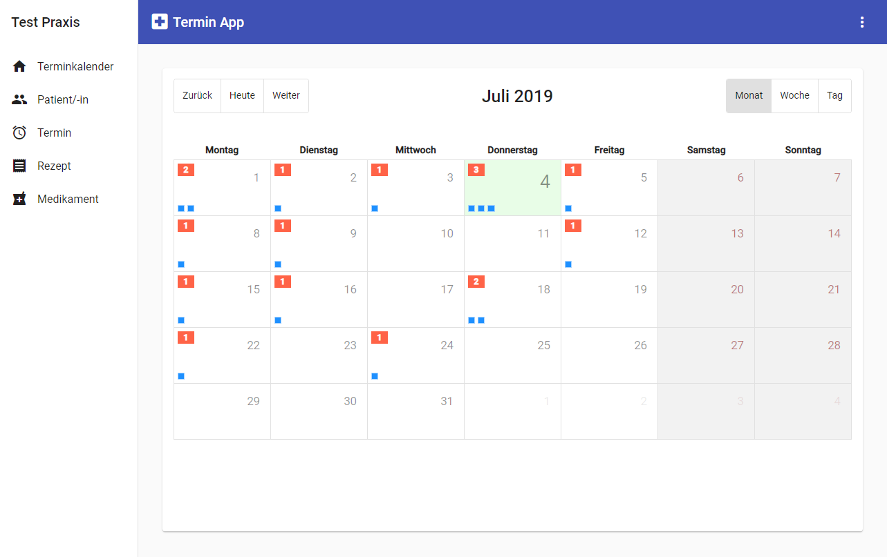
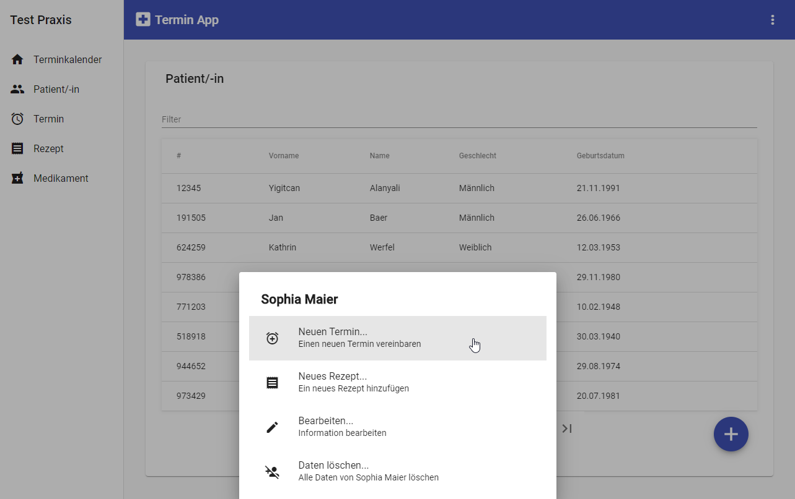

# Introduction
Termin App is an appointment-patient management app for a small doctor's office.

# :ledger: Index

- [About](#beginner-about)
- [Usage](#sunny-usage)
  - [Installation](#electric_plug-installation)
  - [Commands](#package-commands)
- [Development](#wrench-development)
  - [Pre-Requisites](#notebook-pre-requisites)
  - [Development Environment](#nut_and_bolt-development-environment)
  - [File Structure](#file_folder-file-structure)
  - [Build](#hammer-build)  
  - [Deployment](#rocket-deployment)  
- [Resources](#page_facing_up-resources)
- [Gallery](#camera-gallery)
- [Credit/Acknowledgment](#star2-creditacknowledgment)

# :beginner: About
- A Web App for Appointment/Patient Management
- Intended for internal use in a doctor's office, maybe packaged as an Electron app
- Uses a [REST API](https://source.ai.fh-erfurt.de/wa4953al/SS19_JAVA2_ITLand) server with MySQL as backend

# :sunny: Usage
- The app needs to have its backend server running.
- Address of the backend server is defined in `environment/environment.ts`
- A [test server](http://termin-api.chickenkiller.com:8080/api) is included in `environment.ts` as apiRemote

###  :electric_plug: Installation
- Install project dependencies using [Yarn](https://github.com/yarnpkg/yarn) (recommended) **or** npm:
`$ yarn install`
`$ npm i`
- If you're not using the test server, make sure the backend server setup correctly.


###  :package: Commands
- `$ yarn start` or `$ ng serve` to start the Angular project
- `$ yarn serve-docs` or `$ npm run serve-docs` to serve the documentation UI on `:8081`

#  :wrench: Development

### :notebook: Pre-Requisites
The pre-requisites the system needs to test/develop this project:
- Backend server: A REST API
- MySQL as the database for the backend server

A [test server](http://termin-api.chickenkiller.com:8080/api) is included in the project. Check `environment.ts`

###  :file_folder: File Structure

```
.
├── README.md
├── TODO
├── angular.json
├── docs
│   └── ...
├── node_modules
│   └── ...
├── package.json
├── src
│   ├── environments
│   │   ├── environment.prod.ts
│   │   └── environment.ts
│   ├── app
│   │   ├── _guards: GUARDS FOLDER
│   │   │   └── auth.guard.ts
│   │   ├── _helpers: INTERCEPTORS FOLDER
│   │   │   ├── error.interceptor.ts
│   │   │   └── request.interceptor.ts
│   │   ├── _models: MODELS FOLDER
│   │   │   ├── address.ts
│   │   │   ├── appointment-record.ts
│   │   │   ├── appointment.ts
│   │   │   ├── disease.ts
│   │   │   ├── index.ts
│   │   │   ├── medicine.ts
│   │   │   ├── patient.ts
│   │   │   ├── prescription.ts
│   │   │   └── user.ts
│   │   ├── _services: SERVICES FOLDER
│   │   │   ├── appointment.service.ts
│   │   │   ├── authentication.service.ts
│   │   │   ├── index.ts
│   │   │   ├── medicine.service.ts
│   │   │   ├── patient.service.ts
│   │   │   ├── prescription.service.ts
│   │   │   └── user.service.ts
│   │   ├── validators: VALIDATORS FOLDER
│   │   │   └── GenericBackendValidator.ts
│   │   ├── favicon.ico
│   │   ├── index.html
│   │   ├── main.ts
│   │   ├── styles.css
│   │   ├── app-routing.module.ts
│   │   ├── app.component.css
│   │   ├── app.component.html
│   │   ├── app.component.spec.ts
│   │   ├── app.component.ts
│   │   ├── app.module.ts
│   │   │
├───┼───┼───────COMPONENTS BEGIN HERE────────
│   │   │
│   │   ├── appointment
│   │   │   └── ...
│   │   ├── bottom-sheet
│   │   │   └── ...
│   │   ├── calendar
│   │   │   └── ...
│   │   ├── content-card
│   │   │   └── ...
│   │   ├── datetimepicker
│   │   │   └── ...
│   │   ├── form-appointment-add-note
│   │   │   └── ...
│   │   ├── form-delete-appointment
│   │   │   └── ...
│   │   ├── form-delete-medicine
│   │   │   └── ...
│   │   ├── form-delete-patient
│   │   │   └── ...
│   │   ├── form-delete-prescription
│   │   │   └── ...
│   │   ├── form-new-appointment
│   │   │   └── ...
│   │   ├── form-new-patient
│   │   │   └── ...
│   │   ├── form-new-prescription
│   │   │   └── ...
│   │   ├── home
│   │   │   └── ...
│   │   ├── list
│   │   │   └── ...
│   │   ├── login
│   │   │   └── ...
│   │   ├── medicine
│   │   │   └── ...
│   │   ├── navigation
│   │   │   └── ...
│   │   ├── patient
│   │   │   └── ...
│   │   └── prescription
│   │       └── ...
.   .
```

###  :hammer: Build
To build the application, run build command using Yarn or npm:
`$ yarn build`
`$ npm build`

To install and deploy the backend server, please see the project's repo.

- [Backend Server Repo](https://github.com/yalanyali/termin-api)

### :rocket: Deployment
The project can be deployed to any web server after it's [built](#hammer-build).

#  :page_facing_up: Resources
- Backend server repo: https://github.com/yalanyali/termin-api
- Server for testing: http://termin-api.chickenkiller.com:8080/api

**Note on test server:**
**Test server is implemented to be reset in half hour intervals for security purposes.**
**Don't panic if you experience data loss, you will and that's intended.**

#  :camera: Gallery
Home Page - Calendar View  



Patient Page with Bottom Menu Toggled - List View of Patients  


To see more views, please run the application.

